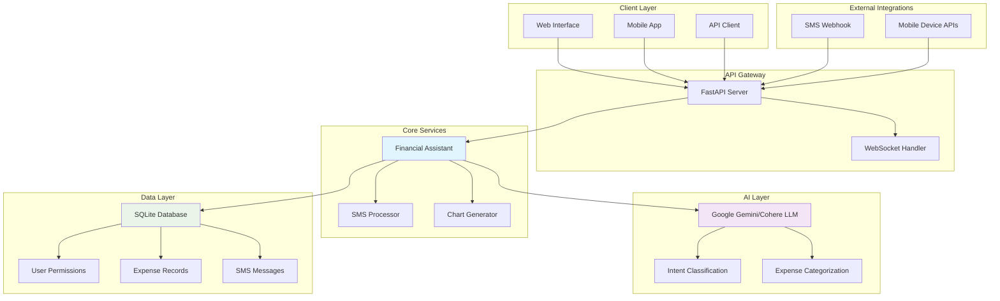
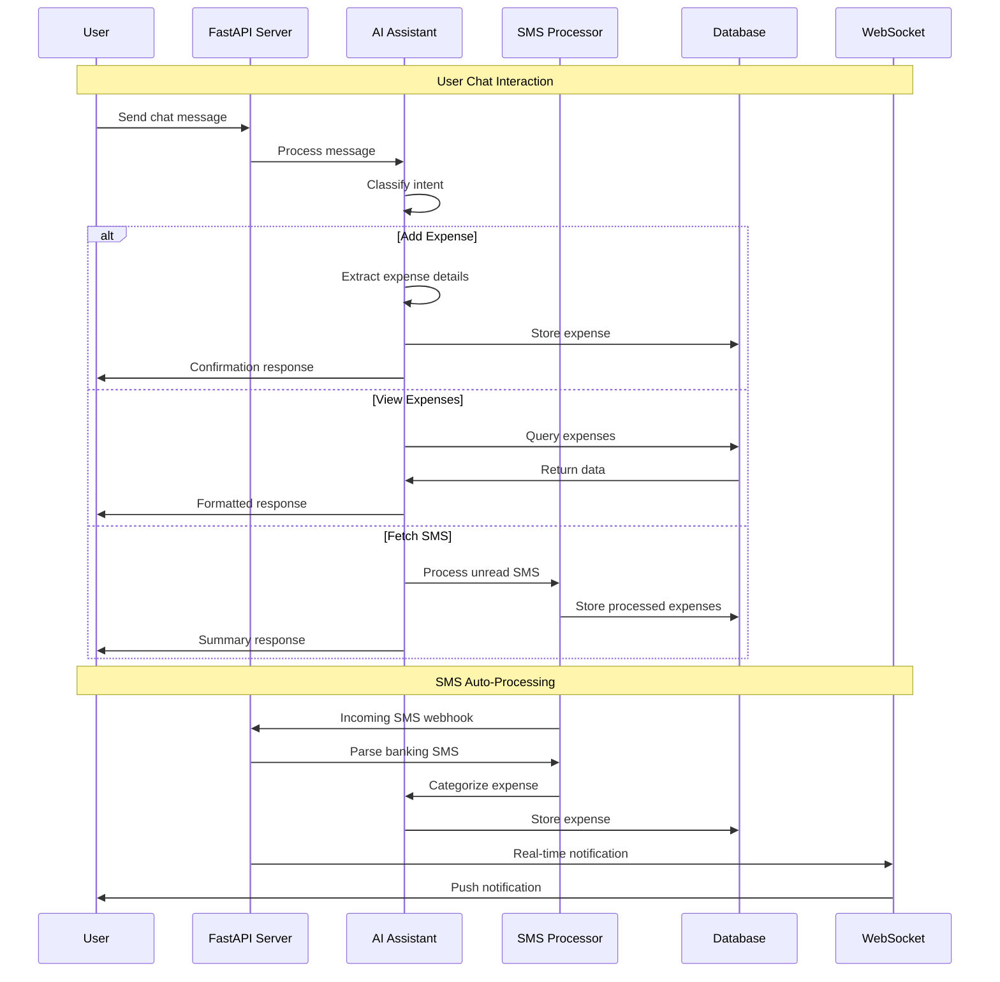
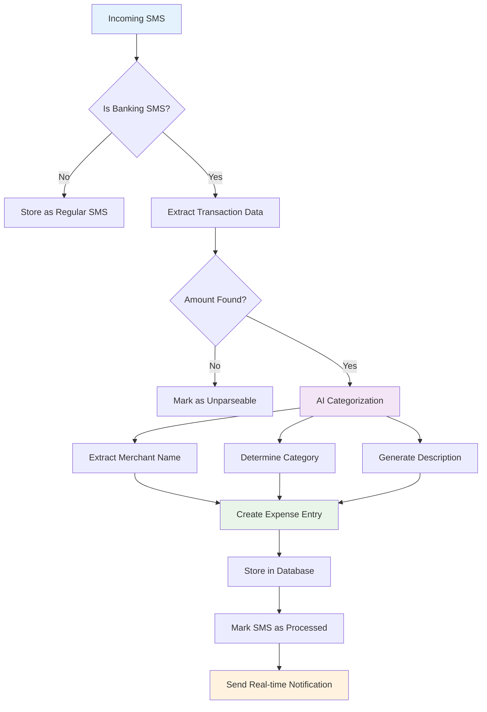
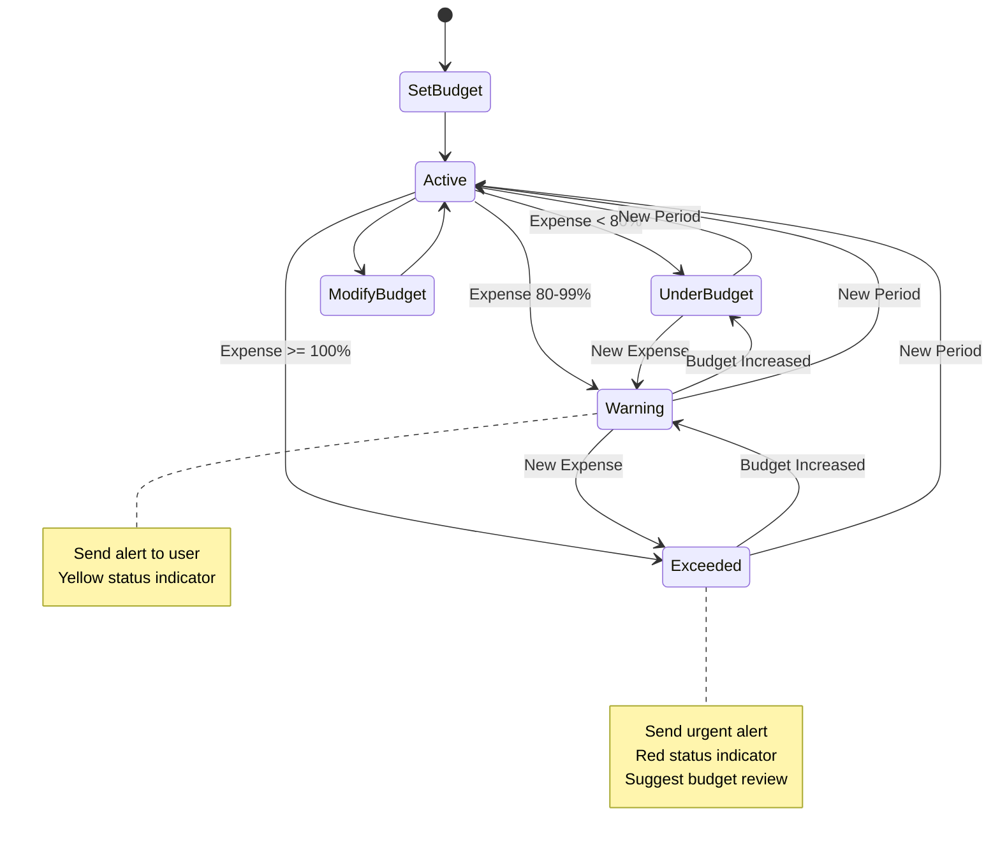

# Integrated Financial Assistant with SMS Auto-Fetch

[](https://www.python.org/downloads/)
[](https://fastapi.tiangolo.com/)
[](https://python.langchain.com/)
[](LICENSE)

A comprehensive AI-powered financial management system that combines intelligent expense tracking, real-time SMS processing, budget management, and interactive chat assistance to provide complete financial oversight and control.

## Features

- **AI-Powered Chat Assistant**: Natural language interaction for financial queries and expense management
- **Automated SMS Processing**: Real-time banking SMS analysis and expense categorization
- **Smart Expense Categorization**: Machine learning-based transaction categorization
- **Budget Management**: Set, track, and monitor spending limits across categories
- **Real-time Notifications**: WebSocket-based instant alerts for new transactions
- **Data Visualization**: Interactive charts and spending analytics
- **Multi-device Support**: Mobile device registration for SMS monitoring
- **RESTful API**: Complete API for integration with other applications

## System Architecture



## Data Flow Architecture



## SMS Processing Workflow



## Budget Management Flow



## Installation

### Prerequisites

- Python 3.8 or higher
- pip (Python package installer)
- SQLite3 (usually included with Python)

### Clone Repository

```bash
git clone https://github.com/yourusername/integrated-financial-assistant.git
cd integrated-financial-assistant
```

### Install Dependencies

```bash
pip install -r requirements.txt
```

### Environment Setup

Create a `.env` file in the root directory:

```env
# AI Model Configuration
GOOGLE_API_KEY=your_google_gemini_api_key_here
COHERE_API_KEY=your_cohere_api_key_here

# Database Configuration
DATABASE_URL=sqlite:///./unified_financial.db

# Security
SECRET_KEY=your_secret_key_here

# Server Configuration
HOST=0.0.0.0
PORT=8000
DEBUG=True
```

### Initialize Database

```bash
python -c "from main import assistant; print('Database initialized successfully!')"
```

## Quick Start

### 1. Start the Server

```bash
python main.py
```

The server will start on `http://localhost:8000`

### 2. Access API Documentation

Visit `http://localhost:8000/docs` for interactive API documentation.

### 3. Basic Usage Examples

#### Chat with the Assistant

```bash
curl -X POST "http://localhost:8000/chat" \
     -H "Content-Type: application/json" \
     -d '{
       "message": "I spent 500 rupees on food today",
       "user_id": "user123"
     }'
```

#### Register Mobile Device

```bash
curl -X POST "http://localhost:8000/register-device" \
     -H "Content-Type: application/json" \
     -d '{
       "device_name": "My Phone",
       "device_type": "android",
       "phone_number": "+91XXXXXXXXXX",
       "user_id": "user123"
     }'
```

#### Set Budget

```bash
curl -X POST "http://localhost:8000/set-budget" \
     -H "Content-Type: application/json" \
     -d '{
       "category": "food",
       "amount": 5000,
       "period": "monthly",
       "user_id": "user123"
     }'
```

## API Endpoints

### Core Chat API

| Endpoint | Method | Description |
|----------|--------|-------------|
| `/chat` | POST | Main chat interface with AI assistant |
| `/register-device` | POST | Register mobile device for SMS monitoring |
| `/sms-webhook` | POST | Webhook for receiving SMS messages |

### Expense Management

| Endpoint | Method | Description |
|----------|--------|-------------|
| `/add-expense` | POST | Manually add expense entry |
| `/expenses/{user_id}` | GET | Retrieve user's expenses |

### Budget Management

| Endpoint | Method | Description |
|----------|--------|-------------|
| `/set-budget` | POST | Set budget for category |
| `/budgets/{user_id}` | GET | Get user's budgets with status |

### Real-time Features

| Endpoint | Method | Description |
|----------|--------|-------------|
| `/ws/{user_id}` | WebSocket | Real-time notifications |
| `/health` | GET | System health check |

## Usage Examples

### 1. Natural Language Expense Tracking

```python
# Users can add expenses naturally
"I paid 1200 for groceries at Big Bazaar"
"Spent ₹45 on Uber ride to office"
"Bought medicines for ₹350"
```

### 2. SMS Integration

The system automatically processes banking SMS messages:

```
"Rs.500.00 debited from your account ending 1234 
on 15-JAN-24 for UPI-SWIGGY-BANGALORE"
```

This gets automatically categorized as:
- Amount: ₹500.00
- Category: Food
- Merchant: Swiggy
- Date: 15-JAN-24

### 3. Budget Monitoring

```python
# Set monthly food budget
"Set ₹5000 monthly budget for food"

# Check budget status
"How's my food budget this month?"

# Get alert when approaching limit
"⚠️ Food budget 85% used. ₹750 remaining."
```

### 4. Expense Analytics

```python
# Generate spending insights
"Show me my spending pattern"
"Create a chart of my expenses"
"Which category do I spend most on?"
```

## Mobile Device Integration

### Android SMS Forwarding

1. Install SMS forwarding app on Android device
2. Configure webhook URL: `https://yourserver.com/sms-webhook`
3. Register device using API
4. Banking SMS will be automatically processed

### iOS Shortcut Integration

1. Create iOS Shortcut for expense logging
2. Configure to send POST request to `/add-expense`
3. Use Siri voice commands for hands-free entry

## Configuration

### AI Model Selection

```python
# In main.py, choose your preferred AI model
assistant = IntegratedFinancialAssistant(
    model_provider="gemini",  # or "cohere"
    api_key="your-api-key"
)
```

### Expense Categories

Customize categories in the database initialization:

```python
default_categories = [
    ('food', 'Food and dining', 'swiggy,zomato,restaurant'),
    ('transport', 'Transportation', 'uber,ola,cab,taxi'),
    ('shopping', 'Shopping', 'amazon,flipkart,myntra'),
    # Add custom categories
]
```

### SMS Processing Rules

Customize SMS parsing patterns:

```python
banking_patterns = {
    'debit_patterns': [
        r'Rs\.?(\d+(?:,\d+)*(?:\.\d{2})?)\s*(?:Dr|debited)',
        # Add custom patterns for your bank
    ]
}
```

## Security Considerations

1. **API Keys**: Store in environment variables, never in code
2. **User Data**: All financial data is stored locally in SQLite
3. **SMS Privacy**: SMS messages are processed locally, not sent to third parties
4. **Device Registration**: Secure device authentication recommended
5. **Data Encryption**: Consider encrypting sensitive database fields

## Troubleshooting

### Common Issues

#### 1. AI Model Not Responding
```bash
# Check API key configuration
echo $GOOGLE_API_KEY

# Verify model availability
curl -X POST "http://localhost:8000/chat" \
     -d '{"message": "test", "user_id": "test"}'
```

#### 2. SMS Not Processing
- Verify webhook URL is accessible
- Check SMS format matches banking patterns
- Review logs for parsing errors

#### 3. Database Issues
```bash
# Reset database
rm unified_financial.db
python -c "from main import assistant; print('Database reset!')"
```

### Logging

Enable detailed logging:

```python
import logging
logging.basicConfig(level=logging.DEBUG)
```

## Contributing

1. Fork the repository
2. Create feature branch (`git checkout -b feature/amazing-feature`)
3. Commit changes (`git commit -m 'Add amazing feature'`)
4. Push to branch (`git push origin feature/amazing-feature`)
5. Open Pull Request

### Development Setup

```bash
# Install development dependencies
pip install -r requirements-dev.txt

# Run tests
pytest tests/

# Run linting
flake8 main.py

# Format code
black main.py
```

## Roadmap

- [ ] **Web Dashboard**: React-based frontend interface
- [ ] **Mobile App**: Native Android/iOS applications
- [ ] **Bank Integration**: Direct API connections with major banks
- [ ] **Machine Learning**: Enhanced categorization with user learning
- [ ] **Multi-currency**: Support for multiple currencies
- [ ] **Export Features**: PDF reports and CSV exports
- [ ] **Collaborative Budgets**: Family/shared expense tracking
- [ ] **Investment Tracking**: Portfolio and investment monitoring

## Performance

### System Requirements

- **RAM**: Minimum 512MB, Recommended 2GB
- **Storage**: 100MB for application + database growth
- **CPU**: Any modern processor
- **Network**: Required for AI API calls

### Scalability

- **Users**: Supports thousands of concurrent users
- **Transactions**: Handles millions of expense records
- **SMS Processing**: Real-time processing of high-volume SMS
- **WebSocket Connections**: Efficient real-time notifications

## License

This project is licensed under the MIT License - see the [LICENSE](LICENSE) file for details.

## Support

- **Documentation**: [Wiki](https://github.com/yourusername/integrated-financial-assistant/wiki)
- **Issues**: [GitHub Issues](https://github.com/yourusername/integrated-financial-assistant/issues)
- **Discussions**: [GitHub Discussions](https://github.com/yourusername/integrated-financial-assistant/discussions)

## Acknowledgments

- [FastAPI](https://fastapi.tiangolo.com/) for the excellent web framework
- [LangChain](https://python.langchain.com/) for AI integration capabilities
- [Google Gemini](https://deepmind.google/technologies/gemini/) and [Cohere](https://cohere.ai/) for AI models
- [SQLite](https://sqlite.org/) for reliable local database storage

---

**Made with ❤️ for better financial management**
