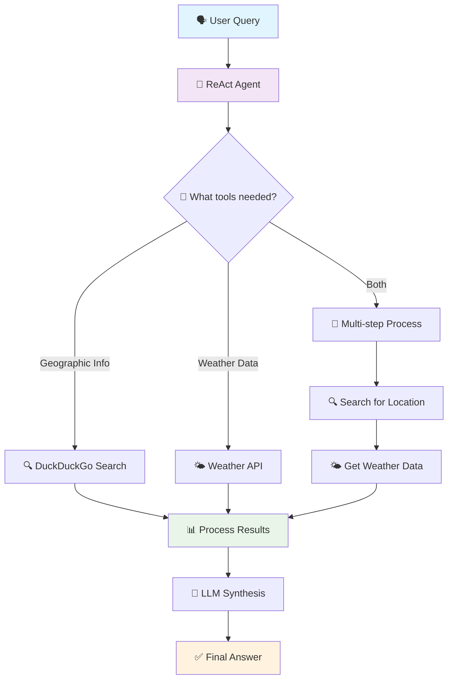

# 🌤️ AI-Powered Weather Agent

<div align="center">


[](https://python.org)
[](https://langchain.com)
[](https://openai.com)
[](https://weatherstack.com)

*An intelligent conversational agent that seamlessly combines geographic knowledge with real-time weather data*

[🚀 Quick Start](#-quick-start) • [🛠️ Features](#️-features) • [📋 Prerequisites](#-prerequisites) • [🔧 Installation](#-installation) • [💡 Usage Examples](#-usage-examples)

</div>

---

## 🌟 Project Overview

The **AI-Powered Weather Agent** is a sophisticated conversational AI system that intelligently processes natural language queries requiring both geographic knowledge and real-time weather information. Built on the powerful **LangChain ReAct framework**, this agent demonstrates advanced agentic AI capabilities by autonomously deciding which tools to use and orchestrating complex multi-step workflows.

### ✨ Key Capabilities

🧠 **Intelligent Reasoning** - Uses ReAct (Reasoning + Acting) paradigm for systematic problem-solving  
🔍 **Dynamic Tool Selection** - Automatically chooses the right tool for each step  
🌍 **Geographic Intelligence** - Finds capitals, major cities, and location information  
🌡️ **Real-time Weather Data** - Fetches current weather conditions from reliable APIs  
💬 **Natural Conversation** - Understands complex, multi-part queries in plain English  

---

## 🛠️ Features

### 🎯 Core Functionality
- **Multi-step Query Processing**: Breaks down complex questions into manageable steps
- **Contextual Tool Usage**: Intelligently selects between web search and weather APIs
- **Real-time Data Integration**: Combines live weather data with static geographic information
- **Conversational Interface**: Natural language input and human-readable responses

### 🔧 Technical Features
- **ReAct Agent Architecture**: Implements thought → action → observation loops
- **Modular Tool System**: Easy to extend with additional tools and APIs
- **Error Handling**: Robust error management for API failures and edge cases
- **Verbose Logging**: Detailed execution traces for debugging and monitoring

---

## 📋 Prerequisites

Before you begin, ensure you have:

- **Python 3.8+** installed on your system
- An **OpenAI API key** (get one from [OpenAI Platform](https://platform.openai.com/))
- A **WeatherStack API key** (free tier available at [WeatherStack](https://weatherstack.com/))
- Internet connection for API calls and web searches

---

## 🔧 Installation

### 1️⃣ Clone the Repository
```bash
git clone https://github.com/your-username/weather-agent.git
cd weather-agent
```

### 2️⃣ Install Dependencies
```bash
pip install -q langchain-openai langchain-community langchain-core requests duckduckgo-search
```

### 3️⃣ Set Up API Keys
```python
# In the first cell of the notebook or your Python script
import os
os.environ["OPENAI_API_KEY"] = "your-openai-api-key-here"
```

> 💡 **Pro Tip**: For production use, consider using a `.env` file or environment variables for API key management.

---

## 🚀 Quick Start

```python
from langchain_openai import ChatOpenAI
from langchain_community.tools import DuckDuckGoSearchRun
from langchain_core.tools import tool
from langchain.agents import create_react_agent, AgentExecutor
from langchain import hub
import requests

# Initialize the LLM
llm = ChatOpenAI()

# Set up tools
search_tool = DuckDuckGoSearchRun()

@tool
def get_weather_data(city: str) -> str:
    """Fetches current weather data for a given city"""
    url = f'https://api.weatherstack.com/current?access_key=YOUR_API_KEY&query={city}'
    response = requests.get(url)
    return response.json()

# Create and run the agent
prompt = hub.pull("hwchase17/react")
agent = create_react_agent(llm=llm, tools=[search_tool, get_weather_data], prompt=prompt)
agent_executor = AgentExecutor(agent=agent, tools=[search_tool, get_weather_data], verbose=True)

# Ask a question!
response = agent_executor.invoke({
    "input": "Find the capital of Madhya Pradesh, then find its current weather condition"
})
print(response['output'])
```

---

## 💡 Usage Examples

### Example 1: Geographic + Weather Query
```python
query = "What's the weather like in the capital of Karnataka?"
response = agent_executor.invoke({"input": query})
```
**Expected Flow:**
1. 🔍 Searches for "capital of Karnataka"
2. 🎯 Finds "Bangalore/Bengaluru"
3. 🌤️ Fetches current weather for Bengaluru
4. 📝 Provides comprehensive answer

### Example 2: Multi-location Comparison
```python
query = "Compare the weather between the capitals of Rajasthan and Kerala"
response = agent_executor.invoke({"input": query})
```

### Example 3: Complex Geographic Query
```python
query = "What's the weather like in the financial capital of India?"
response = agent_executor.invoke({"input": query})
```

---

## 🏗️ Architecture & Workflow

<div align="center">



</div>

### 🔄 ReAct Loop Breakdown

| Step | Description | Example |
|------|-------------|---------|
| **Thought** 💭 | Agent analyzes the query | "I need to find the capital first, then get weather data" |
| **Action** 🎯 | Selects and executes appropriate tool | `DuckDuckGoSearchRun("capital of Madhya Pradesh")` |
| **Observation** 👀 | Processes tool output | "Found: Bhopal is the capital" |
| **Synthesis** 🔗 | Combines information for final answer | "Bhopal is the capital and current temp is 25°C" |

---

## 🛠️ Technical Stack

<table align="center">
<tr>
<td align="center"><strong>🤖 AI Framework</strong></td>
<td align="center"><strong>🔧 Tools & APIs</strong></td>
<td align="center"><strong>🌐 Integration</strong></td>
</tr>
<tr>
<td>
• LangChain Agent Framework<br>
• ReAct (Reasoning + Acting)<br>
• ChatOpenAI (GPT-4/3.5)<br>
• Custom Tool Integration
</td>
<td>
• DuckDuckGo Search API<br>
• WeatherStack API<br>
• Python Requests Library<br>
• JSON Data Processing
</td>
<td>
• REST API Integration<br>
• Error Handling & Retries<br>
• Verbose Logging<br>
• Modular Architecture
</td>
</tr>
</table>

---

## 📊 Performance & Capabilities

### ✅ What the Agent Can Do
- ✅ Find capitals and major cities of countries/states
- ✅ Get real-time weather data for any location
- ✅ Process complex, multi-step geographic queries
- ✅ Handle variations in location names and spellings
- ✅ Provide detailed weather information (temperature, humidity, conditions)
- ✅ Combine multiple data sources for comprehensive answers

### ⚠️ Current Limitations
- ⚠️ Dependent on external API availability
- ⚠️ Limited by API rate limits
- ⚠️ Weather data accuracy depends on WeatherStack service
- ⚠️ May struggle with very ambiguous location names

---

## 🚀 Advanced Configuration

### Custom Weather Function
```python
@tool
def get_detailed_weather(city: str, days: int = 1) -> str:
    """Enhanced weather function with forecast capability"""
    url = f'https://api.weatherstack.com/current'
    params = {
        'access_key': 'YOUR_API_KEY',
        'query': city,
        'units': 'm',  # metric units
        'hourly': 1 if days > 1 else 0
    }
    response = requests.get(url, params=params)
    return response.json()
```

### Adding More Tools
```python
@tool
def get_time_zone(city: str) -> str:
    """Get timezone information for a city"""
    # Implementation here
    pass

# Add to agent
tools = [search_tool, get_weather_data, get_detailed_weather, get_time_zone]
```

---

## 🤝 Contributing

We welcome contributions! Here's how you can help:

1. 🍴 **Fork** the repository
2. 🌿 **Create** a feature branch (`git checkout -b feature/AmazingFeature`)
3. 💻 **Commit** your changes (`git commit -m 'Add some AmazingFeature'`)
4. 📤 **Push** to the branch (`git push origin feature/AmazingFeature`)
5. 🔄 **Open** a Pull Request

### 💡 Ideas for Contributions
- 📈 Add weather forecast capabilities
- 🗺️ Integrate mapping/geographic visualization
- 🔧 Add more data sources (air quality, UV index, etc.)
- 🌍 Multi-language support
- 📱 Create a web/mobile interface

---

## 📜 License

This project is licensed under the **MIT License** - see the [LICENSE](LICENSE) file for details.

---

## 🙏 Acknowledgments

- 🦜 **LangChain** team for the incredible framework
- 🧠 **OpenAI** for powerful language models
- 🦆 **DuckDuckGo** for search capabilities
- 🌤️ **WeatherStack** for weather data

---

<div align="center">

**⭐ If you found this project helpful, please give it a star! ⭐**

Made with ❤️ by the AI Community

</div>
