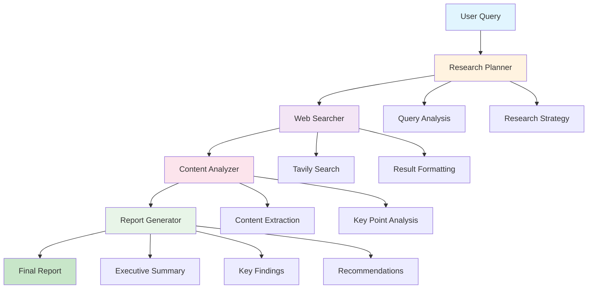
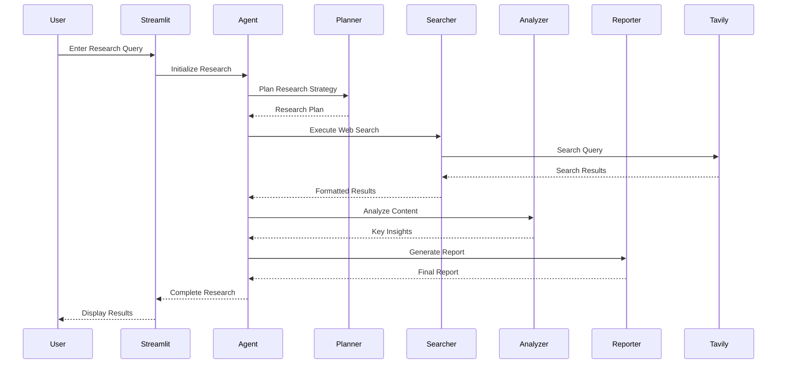
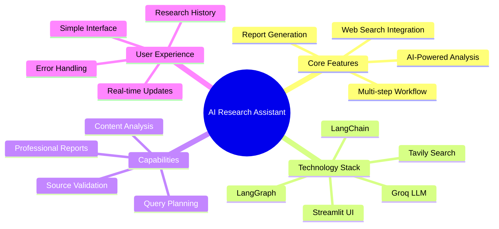

# 🔍 AI Research Assistant

A powerful research assistant built with **LangChain**, **LangGraph**, **Groq**, and **Tavily** that conducts comprehensive research on any topic using AI-powered web search and analysis.


*The intuitive dark-themed interface showing a research query about "blackhole" with structured workflow and results display.*

## 🖥️ Interface Overview

The application features a clean, dark-themed interface with:

- **🔍 Research Query Input**: Large text area for entering research topics
- **🚀 Start Research Button**: Initiates the AI-powered research workflow
- **🗑️ Clear History**: Removes all previous research sessions
- **📊 Research Results**: Expandable sections showing detailed research reports
- **📈 Real-time Status**: Live updates during the research process

## ✨ Features

- **🤖 AI-Powered Research**: Uses advanced LLMs for intelligent research planning and analysis
- **🔍 Web Search Integration**: Leverages Tavily for comprehensive web search capabilities
- **📊 Content Analysis**: Automatically analyzes and extracts key insights from search results
- **📄 Report Generation**: Creates structured, professional research reports
- **💾 Research History**: Maintains a history of all research queries and results
- **🎯 Workflow Orchestration**: Uses LangGraph for structured, multi-step research workflows
- **⚡ Fast Inference**: Powered by Groq for lightning-fast LLM responses

## 🏗️ Architecture

The application follows a structured workflow using LangGraph:



## 🚀 Quick Start

### Prerequisites

- Python 3.8+
- Git
- API Keys for Groq and Tavily

### Installation

1. **Clone the repository**
```bash
git clone https://github.com/yourusername/ai-research-assistant.git
cd ai-research-assistant
```

2. **Install dependencies**
```bash
pip install -r requirements.txt
```

3. **Set up environment variables**

Create a `.env` file in the project root:
```env
GROQ_API_KEY=gsk_your_actual_groq_api_key_here
TAVILY_API_KEY=tvly-your_actual_tavily_api_key_here
```

4. **Run the application**
```bash
streamlit run app.py
```

5. **Open your browser**
Navigate to `http://localhost:8501` to access the application.

### Quick Demo
1. Enter a research topic like "quantum computing advances 2024"
2. Click "🔍 Start Research"
3. Watch the AI workflow in action
4. Review the comprehensive research report

## 🔧 Configuration

### API Keys Setup

#### Groq API Key
1. Visit [console.groq.com](https://console.groq.com)
2. Create an account and generate an API key
3. Format: `gsk_xxxxxxxxxxxxxxxxxxxxxxxxx`

#### Tavily API Key
1. Visit [tavily.com](https://tavily.com)
2. Sign up and get your API key
3. Format: `tvly-xxxxxxxxxxxxxxxxxxxxxxxxx`

### Supported Models

The application uses the latest Groq models:
- **Default**: `llama-3.3-70b-versatile`
- **Temperature**: 0.3 for balanced creativity and accuracy

## 📊 System Workflow



## 🏗️ Project Structure

```
ai-research-assistant/
├── app.py                 # Main Streamlit application
├── requirements.txt       # Python dependencies
├── .env                  # Environment variables (create this)
├── .env.example          # Environment variables template
├── README.md             # This file
├── .gitignore           # Git ignore rules
├── LICENSE              # MIT License
└── docs/                # Documentation and assets
    ├── images/          # Screenshots and diagrams
    │   └── screenshot.png  # Main interface screenshot
    └── examples/        # Usage examples
        └── sample_queries.md
```

## 📋 Dependencies

Create a `requirements.txt` file with the following dependencies:

```txt
streamlit>=1.28.0
langchain>=0.1.0
langchain-groq>=0.1.0
langchain-community>=0.0.20
langgraph>=0.0.40
tavily-python>=0.3.0
pydantic>=1.10.0
typing-extensions>=4.5.0
python-dotenv>=1.0.0
```

## 🔄 Workflow Components

### 1. Research Planner
- Analyzes user queries
- Creates structured research strategies
- Breaks down complex topics into searchable queries

### 2. Web Searcher
- Performs advanced web searches using Tavily
- Retrieves multiple sources per query
- Formats results for analysis

### 3. Content Analyzer
- Extracts key insights from search results
- Identifies important data points
- Summarizes findings

### 4. Report Generator
- Creates comprehensive research reports
- Structures information professionally
- Provides recommendations and sources

## 💻 Usage Examples

### Basic Research Query
```python
# Example: Simple topic research
Query: "blackhole"

Expected Output:
✅ Research Report Generated
📊 Key findings about black hole physics
🔗 Multiple scientific sources
📈 Recent discoveries and theories
💡 Recommendations for further reading
```

### Complex Research Topic
```python
# Example: Multi-faceted analysis
Query: "Compare renewable energy adoption rates across different countries and analyze the economic impact"

Expected Workflow:
1. 📋 Plan: Identify countries, energy types, economic metrics
2. 🔍 Search: Find comparative studies and economic data  
3. 📊 Analyze: Extract adoption rates and economic impacts
4. 📄 Report: Create comparative analysis with recommendations
```

## 🎯 Key Features Breakdown



## 🔍 Search Capabilities

The assistant can research various topics including:

- **📈 Market Analysis**: Industry trends, competitor analysis, market size
- **🧬 Scientific Research**: Latest studies, research papers, discoveries
- **📰 Current Events**: News analysis, event timelines, impact assessment
- **💼 Business Intelligence**: Company research, financial analysis, industry insights
- **🎓 Academic Topics**: Literature reviews, theoretical concepts, case studies
- **🌍 Global Issues**: Environmental concerns, social trends, political developments

## 🛠️ Troubleshooting

### Common Issues

#### API Key Errors
```bash
❌ Invalid Groq API Key Format!
```
**Solution**: Ensure your Groq API key starts with `gsk_`

#### Search Errors
```bash
❌ Tavily API Key Invalid
```
**Solution**: Verify your Tavily API key starts with `tvly-`

#### Installation Issues
```bash
pip install --upgrade streamlit langchain-groq
```

### Environment Setup
For deployment on cloud platforms:

#### Streamlit Cloud
1. Add secrets in Streamlit Cloud dashboard
2. Use `st.secrets` to access API keys

#### Heroku/Railway
1. Set environment variables in platform settings
2. Ensure `.env` is in `.gitignore`

## 🔒 Security Considerations

- **API Keys**: Never commit API keys to version control
- **Environment Variables**: Use `.env` files for local development
- **Rate Limiting**: Built-in rate limiting for API calls
- **Error Handling**: Comprehensive error handling for API failures

## 🤝 Contributing

1. Fork the repository
2. Create a feature branch (`git checkout -b feature/amazing-feature`)
3. Commit your changes (`git commit -m 'Add amazing feature'`)
4. Push to the branch (`git push origin feature/amazing-feature`)
5. Open a Pull Request

### Development Guidelines

- Follow PEP 8 style guidelines
- Add docstrings to all functions
- Include error handling for API calls
- Test with different query types
- Update documentation for new features

## 📜 License

This project is licensed under the MIT License - see the [LICENSE](LICENSE) file for details.

## 🙏 Acknowledgments

- **LangChain Team** for the excellent framework
- **Groq** for fast LLM inference
- **Tavily** for comprehensive web search
- **Streamlit** for the intuitive UI framework

## 📞 Support

- 🐛 **Issues**: [GitHub Issues](https://github.com/yourusername/ai-research-assistant/issues)
- 💬 **Discussions**: [GitHub Discussions](https://github.com/yourusername/ai-research-assistant/discussions)
- 📧 **Email**: your.email@example.com

---

**⭐ Star this repository if you find it helpful!**

Made with ❤️ using LangChain, LangGraph, and Streamlit
