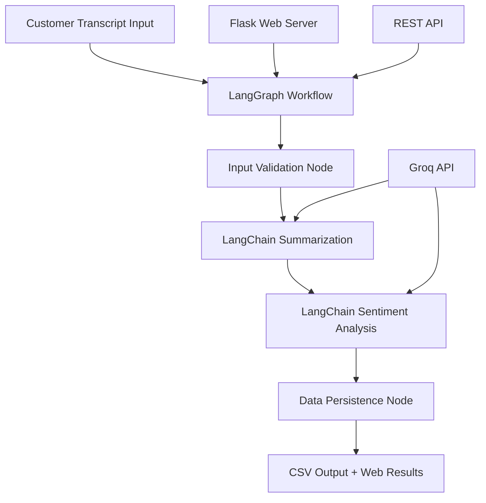

# 🤖 LangChain & LangGraph Conversation Analysis

[](https://www.python.org/downloads/)
[](https://flask.palletsprojects.com/)
[](https://python.langchain.com/)
[](https://langchain-ai.github.io/langgraph/)
[](https://opensource.org/licenses/MIT)

A sophisticated Flask web application that demonstrates advanced AI workflow orchestration using **LangChain** and **LangGraph** for automated conversation analysis. This application processes customer call transcripts, generates intelligent summaries, performs sentiment analysis, and saves structured results to CSV files.

## 🚀 Features

- **🔄 Advanced Workflow Orchestration**: LangGraph state-based workflow management
- **🤖 AI-Powered Analysis**: LangChain integration with Groq's high-performance LLMs
- **📝 Intelligent Summarization**: Context-aware conversation summarization
- **😊 Sentiment Analysis**: Multi-class sentiment classification with emotion detection
- **💾 Data Persistence**: Automatic CSV export with timestamps and processing metrics
- **🌐 Web Interface**: User-friendly Flask web application
- **🔌 REST API**: Programmatic access via JSON endpoints
- **⚡ Real-time Processing**: Live workflow execution monitoring
- **🛡️ Error Handling**: Comprehensive validation and recovery mechanisms

## 🏗️ Architecture



### Core Components

- **LangGraph StateGraph**: Orchestrates the entire analysis workflow
- **LangChain Chains**: Handle AI model interactions and prompt engineering
- **Groq Integration**: Provides high-speed LLM inference via `llama-3.3-70b-versatile`
- **Flask Framework**: Web interface and API endpoints
- **State Management**: Persistent workflow state across processing nodes

## 📋 Prerequisites

- Python 3.8 or higher
- Groq API key (free at [console.groq.com](https://console.groq.com/keys))
- Basic familiarity with Flask applications

## ⚡ Quick Start

### 1. Clone the Repository

```bash
git clone https://github.com/yourusername/langchain-langgraph-conversation-analysis.git
cd langchain-langgraph-conversation-analysis
```

### 2. Set Up Virtual Environment

```bash
# Create virtual environment
python -m venv venv

# Activate virtual environment
# On Windows:
venv\Scripts\activate
# On macOS/Linux:
source venv/bin/activate
```

### 3. Install Dependencies

```bash
pip install -r requirements.txt
```

### 4. Configure API Key

Create a `.env` file in the project root:

```env
GROQ_API_KEY=your_groq_api_key_here
```

Or set as environment variable:

```bash
export GROQ_API_KEY="your_groq_api_key_here"
```

### 5. Run the Application

```bash
python app.py
```

Visit [http://localhost:5000](http://localhost:5000) to access the web interface.

## 📦 Dependencies

Create a `requirements.txt` file:

```txt
flask==2.3.3
langchain==0.1.0
langchain-groq==0.1.0
langgraph==0.1.0
python-dotenv==1.0.0
pydantic==2.5.0
```

## 🔧 Configuration

### Environment Variables

| Variable | Description | Required | Default |
|----------|-------------|----------|---------|
| `GROQ_API_KEY` | Your Groq API key for LLM access | Yes | None |
| `CSV_FILE` | Output CSV file path | No | `call_analysis.csv` |
| `FLASK_PORT` | Flask server port | No | `5000` |

### LangChain Configuration

The application uses the following LangChain components:

- **Model**: `llama-3.3-70b-versatile` via Groq
- **Temperature**: 0.1 for consistent, focused responses
- **Prompt Templates**: Custom templates optimized for conversation analysis
- **Output Parsing**: Structured text extraction and validation

### LangGraph Workflow Nodes

1. **Input Validation**: Validates transcript length and format
2. **Summarization**: Generates 2-3 sentence summaries using LangChain
3. **Sentiment Analysis**: Classifies sentiment as Positive/Neutral/Negative
4. **Data Persistence**: Saves structured results to CSV with metadata

## 🌐 API Endpoints

### Web Interface
- `GET /` - Main web interface
- `POST /analyze` - Form submission for transcript analysis

### REST API
- `POST /api/analyze` - JSON API for programmatic access
- `GET /health` - System health check
- `GET /workflow-info` - Workflow configuration details

### API Usage Example

```bash
curl -X POST http://localhost:5000/api/analyze \
  -H "Content-Type: application/json" \
  -d '{
    "transcript": "I am very satisfied with your excellent customer service. The support team resolved my issue quickly and professionally. Thank you!"
  }'
```

**Response:**
```json
{
  "success": true,
  "transcript": "I am very satisfied with...",
  "summary": "Customer expresses high satisfaction with customer service quality and quick issue resolution by the support team.",
  "sentiment": "Positive (satisfied)",
  "processing_time": 2.34,
  "timestamp": "2024-01-15T10:30:45",
  "workflow": "LangGraph + LangChain"
}
```

## 📊 Sample Use Cases

### Customer Service Analysis
```python
transcript = """
Hi, I was trying to book a slot yesterday but the payment failed. 
I'm very frustrated because I need that appointment urgently. 
Can you please help me check my booking status?
"""
```

**Expected Output:**
- **Summary**: "Customer experienced payment failure during booking process and requires urgent assistance to verify appointment status due to time constraints."
- **Sentiment**: "Negative (frustrated)"

### Positive Feedback Processing
```python
transcript = """
I just wanted to express my gratitude for the excellent support. 
Your team helped me resolve the software issue within minutes. 
I'm very satisfied with the service quality.
"""
```

**Expected Output:**
- **Summary**: "Customer expresses sincere appreciation for efficient technical support that quickly resolved their software issue."
- **Sentiment**: "Positive (grateful)"

## 🗂️ Output Format

Results are automatically saved to `call_analysis.csv`:

| Timestamp | Transcript | Summary | Sentiment | Processing_Time_Seconds |
|-----------|------------|---------|-----------|-------------------------|
| 2024-01-15 10:30:45 | "Hi, I was trying to book..." | "Customer experienced payment failure..." | "Negative (frustrated)" | 2.34 |
| 2024-01-15 10:32:12 | "Thank you for the excellent..." | "Customer expresses sincere gratitude..." | "Positive (grateful)" | 1.87 |

## 🧪 Testing

### Manual Testing via Web Interface

1. Start the application: `python app.py`
2. Navigate to [http://localhost:5000](http://localhost:5000)
3. Use the provided sample transcripts or enter your own
4. Review results and check CSV output

### Automated API Testing

```bash
# Test positive sentiment
curl -X POST http://localhost:5000/api/analyze \
  -H "Content-Type: application/json" \
  -d '{"transcript": "Excellent service! Very satisfied with the quick resolution."}'

# Test negative sentiment  
curl -X POST http://localhost:5000/api/analyze \
  -H "Content-Type: application/json" \
  -d '{"transcript": "Very frustrated with the payment system errors. Need immediate help."}'

# Health check
curl http://localhost:5000/health
```

## 🔍 Monitoring & Debugging

### Console Logging

The application provides detailed console output for workflow monitoring:

```
🚀 STARTING LANGGRAPH WORKFLOW
============================================================
📄 Input transcript: 285 characters
🕐 Start time: 10:30:45

==================================================
🔍 LANGGRAPH NODE: Input Validation
==================================================
✅ Transcript length: 285 characters
✅ Input validation passed

==================================================
📝 LANGGRAPH NODE: Summarization (LangChain)
==================================================
🔄 Invoking LangChain summary chain...
✅ Summary generated in 1.23 seconds

==================================================
😊 LANGGRAPH NODE: Sentiment Analysis (LangChain)
==================================================
🔄 Invoking LangChain sentiment chain...
✅ Sentiment analyzed in 0.87 seconds

🎯 LANGGRAPH WORKFLOW COMPLETED
============================================================
✅ Status: SUCCESS
⏱️ Processing time: 2.34 seconds
💾 Saved to: call_analysis.csv
```

### Health Monitoring

```bash
curl http://localhost:5000/health
```

```json
{
  "status": "healthy",
  "langchain_ready": true,
  "csv_file_exists": true,
  "workflow_engine": "LangGraph",
  "llm_provider": "LangChain-Groq"
}
```

## 🚨 Troubleshooting

### Common Issues

#### API Key Problems
```bash
# Check if API key is properly loaded
python -c "import os; from dotenv import load_dotenv; load_dotenv(); print('Key loaded:', bool(os.environ.get('GROQ_API_KEY')))"
```

#### Dependency Issues
```bash
# Reinstall all dependencies
pip install --upgrade -r requirements.txt
```

#### Port Conflicts
```bash
# Use different port
export FLASK_PORT=5001
python app.py
```

#### CSV Permission Errors
```bash
# Check file permissions
ls -la call_analysis.csv
# Delete and recreate if needed
rm call_analysis.csv
python app.py
```

### Error Handling

The application includes comprehensive error handling:

- **Input Validation**: Checks transcript length and content
- **API Failures**: Graceful handling of Groq API issues
- **File System**: CSV write permission and disk space checks  
- **Workflow State**: Recovery from partial processing failures

## 📈 Performance Optimization

### Response Times
- **Input Validation**: ~0.01 seconds
- **Summarization**: ~1.5 seconds (varies with transcript length)
- **Sentiment Analysis**: ~0.8 seconds
- **Total Processing**: Typically 2-4 seconds per transcript

### Scalability Considerations
- Consider implementing request queuing for high volume
- Add Redis caching for repeated analysis
- Implement batch processing for multiple transcripts
- Use async processing for API calls

## 🤝 Contributing

1. Fork the repository
2. Create a feature branch (`git checkout -b feature/amazing-feature`)
3. Commit your changes (`git commit -m 'Add amazing feature'`)
4. Push to the branch (`git push origin feature/amazing-feature`)
5. Open a Pull Request

### Development Guidelines

- Follow PEP 8 style guidelines
- Add comprehensive docstrings
- Include unit tests for new features
- Update documentation as needed

## 📄 License

This project is licensed under the MIT License - see the [LICENSE](LICENSE) file for details.

## 🙏 Acknowledgments

- [LangChain](https://python.langchain.com/) for the powerful AI framework
- [LangGraph](https://langchain-ai.github.io/langgraph/) for workflow orchestration
- [Groq](https://groq.com/) for high-performance LLM inference
- [Flask](https://flask.palletsprojects.com/) for the web framework

## 📞 Support

For support, please open an issue on GitHub or contact [your-email@example.com](shupandee@gmail.com).

## 🔗 Related Projects

- [LangChain Documentation](https://python.langchain.com/docs/get_started/introduction.html)
- [LangGraph Tutorials](https://langchain-ai.github.io/langgraph/tutorials/)
- [Groq API Documentation](https://console.groq.com/docs/quickstart)

---

⭐ **Star this repository if you find it helpful!**
